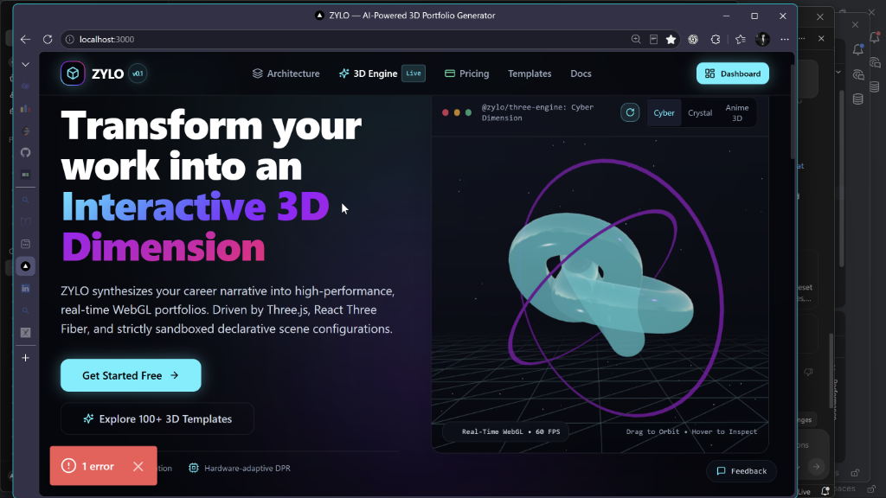
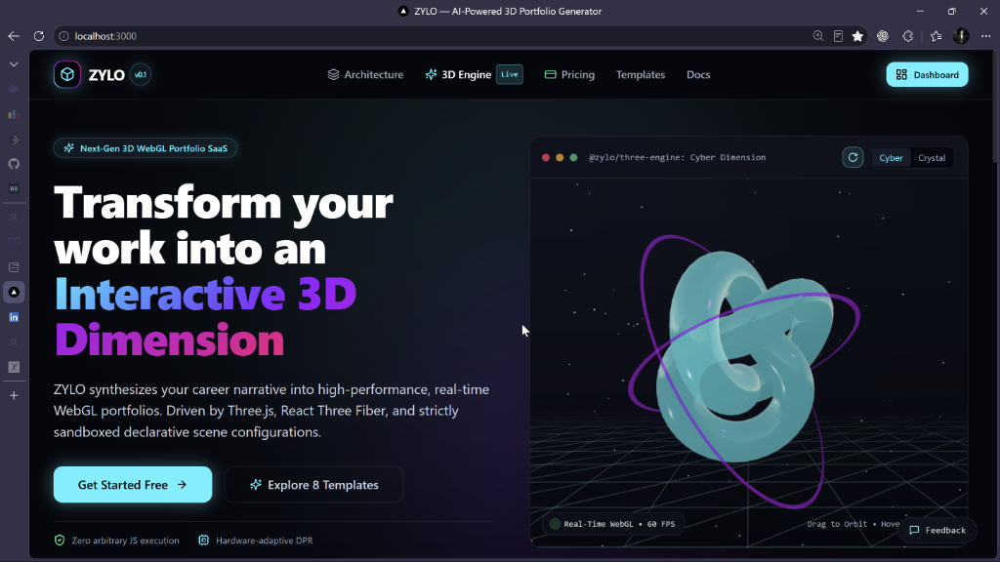
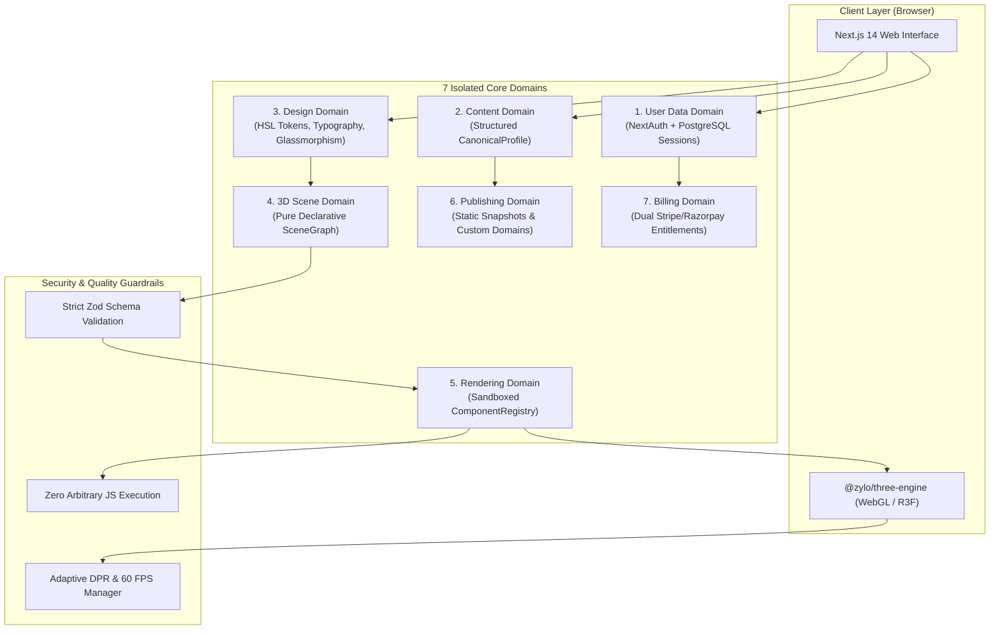
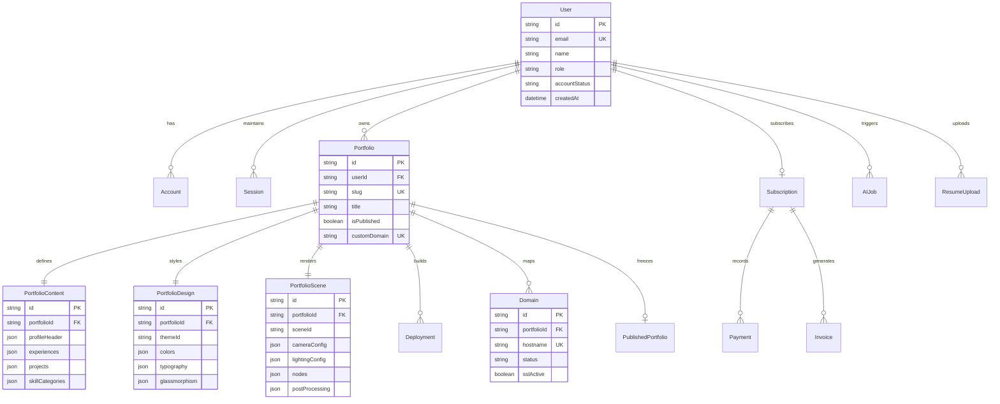
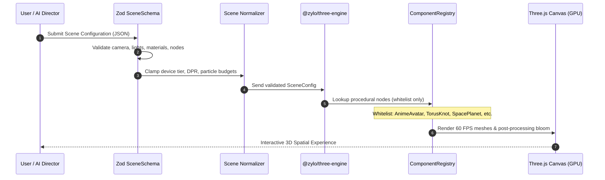

# ZYLO — AI-Powered 3D WebGL Portfolio Generator SaaS

<div align="center">

```
   ______ __  __ __    ____     _____ ____ 
  /_  __// / / // /   / __ \   |__  // __ \
   / /  / /_/ // /   / / / /    /_ </ / / /
  / /   \__, // /___/ /_/ /   ___/ / /_/ / 
 /_/   /____//_____/\____/   /____/_____/  
```

### Next-Generation Spatial WebGL Portfolio SaaS Platform
*Transform career narratives, GitHub histories, and natural-language style prompts into hyper-immersive, real-time 3D spatial portfolio websites.*

[](https://www.typescriptlang.org/)
[](https://nextjs.org/)
[](https://threejs.org/)
[](https://vitest.dev/)
[](https://github.com)
[](http://localhost:3000/templates)

<br />

<p align="center">
  <a href="#-frameworks--core-tech-stack">Frameworks</a> •
  <a href="#-picture-it-working--live-demonstrations">Picture It Working</a> •
  <a href="#-system-architecture--model-diagrams">Architecture & Models</a> •
  <a href="#-comprehensive-tasks-completed">Tasks Completed</a> •
  <a href="#-upcoming-tasks--roadmap">Upcoming Tasks</a> •
  <a href="#-running-locally">Quick Start</a>
</p>

</div>

---

## 📸 Picture It Working & Live Demonstrations

Experience ZYLO's spatial rendering capabilities directly in the browser with real-time 60 FPS WebGL, interactive 3D dimension switching, and sandboxed procedural geometry.

### 1. 3D Command Center & Real-Time Dimension Engine
The homepage operates as a live **3D Command Center** allowing visitors to switch between 5 real-time spatial dimensions, toggle wireframes, and monitor WebGL GPU telemetry in real time:

<div align="center">
  
  <p><em>Real-Time 3D Hero Viewport rendering the Cel-Shaded Anime Character Avatar with dynamic wireframe toggle, 60 FPS GPU monitor, and 5 instant spatial dimensions.</em></p>
</div>

```
┌────────────────────────────────────────────────────────────────────────────────────────┐
│ [● 60 FPS WebGL] [VRAM: OPTIMAL] [GPU DPR: 2.0]                     [WIREFRAME: OFF]   │
│                                                                                        │
│     SWITCH DIMENSION:  [1. Anime 3D]  [2. Cyber Core]  [3. Crystal Prism] ...          │
│                                                                                        │
│                                 ▲  (Camera Orbit)                                      │
│                             ┌───────┐                                                  │
│                       ◄───  │ 3D    │  ───► (Sinusoidal Sakura Petals / Dust)          │
│                             │ MESH  │                                                  │
│                             └───────┘                                                  │
│                                 ▼                                                      │
│                                                                                        │
│  TELEMETRY HUD: 7 Isolated Domains  |  Zero Arbitrary JS  |  Zod Sandboxed Pipeline    │
└────────────────────────────────────────────────────────────────────────────────────────┘
```

---

### 2. Flagship 3D Presets Showcase (100+ Catalog)
Creators can browse across 10 core aesthetic families inspired by Framer, Webflow, and ThemeForest 3D with interactive 3D perspective mouse tilt cards (`TiltCard3D`):

<div align="center">
  
  <p><em>Curated 3D Template Showcase highlighting Neo-Tokyo Anime, Fusion AI, INKY Atelier, Mōno X, and Artemis Space with direct studio loading.</em></p>
</div>

---

### 3. Interactive Live 3D Mesh & Shader Playground
Visitors can tweak procedural geometry, material roughness, bloom intensity, and color palettes with live compiled `SceneSchema` JSON synchronization:

<div align="center">
  
  <p><em>Interactive 3D Playground with real-time procedural mesh selector, bloom post-processing slider, and instant JSON scene compilation.</em></p>
</div>

---

## ⚡ Frameworks & Core Tech Stack

ZYLO leverages modern web, 3D graphics, and AI standards to deliver sub-millisecond response times, airtight sandboxed rendering, and hardware-adaptive frame rates:

| Layer | Framework / Technology | Purpose |
| :--- | :--- | :--- |
| **Frontend Framework** | **[Next.js 14](https://nextjs.org/)** (App Router) | React Server Components (RSC), server actions, dynamic metadata, edge route handlers |
| **Language** | **[TypeScript 5](https://www.typescriptlang.org/)** | 100% strictly typed monorepo with zero `any` leaks across all packages |
| **3D Rendering Engine** | **[Three.js](https://threejs.org/)** + **[React Three Fiber](https://r3f.docs.pmnd.rs/)** | Declarative WebGL runtime, reactive camera controls, dynamic lighting, bloom post-processing |
| **3D Helpers** | **[@react-three/drei](https://github.com/pmndrs/drei)** | Procedural meshes, instanced particles, orbit controls, HDR environment maps |
| **Styling & Design System**| **[Tailwind CSS](https://tailwindcss.com/)** + **Vanilla CSS** | Glassmorphism blur, neon glow tokens, HSL color space, responsive 3D perspective grids |
| **Database & ORM** | **[PostgreSQL](https://www.postgresql.org/)** + **[Prisma ORM](https://www.prisma.io/)** | Relational schema for users, portfolios, themes, scenes, domains, and billing records |
| **Validation & Security** | **[Zod](https://zod.dev/)** | Sandboxed schema validation (`SceneSchema`, `ThemeSchema`, `ContentSchema`, `BillingSchema`) |
| **Authentication** | **[NextAuth.js](https://next-auth.js.org/)** | Credential login, multi-tenant session tokens, secure auth cookies |
| **AI Orchestration** | **Multi-Provider AI** (`@zylo/ai`) | OpenAI GPT-4o / GPT-4o-mini, Anthropic Claude, Google Gemini, and structured fallbacks |
| **Payment Gateways** | **[Stripe](https://stripe.com/)** & **[Razorpay](https://razorpay.com/)** | Dual international (USD) and domestic (INR) subscription billing & idempotent webhooks |
| **Test Runner** | **[Vitest](https://vitest.dev/)** | High-speed unit, integration, schema validation, and end-to-end testing (234 tests) |

---

## 🏛️ System Architecture & Model Diagrams

### 1. The 7 Decoupled Core Domains
ZYLO strictly enforces domain isolation. No domain directly accesses internal state of another domain without passing through typed schema validation:



---

### 2. Relational Data Model (Prisma ORM Diagram)
The underlying PostgreSQL database schema maintains strict referential integrity across the 7 domains:



---

### 3. Sandboxed 3D WebGL Rendering Pipeline
Unlike risky platforms that `eval()` arbitrary user JavaScript, ZYLO treats 3D scenes as pure, declarative JSON configurations validated by Zod:



---

### 4. Non-Destructive Template & Preset Engine

```mermaid
graph LR
    subgraph BaseTemplates["13 Flagship Core Templates"]
        T1[Anime & Character]
        T2[Neural / AI]
        T3[Orbit / Space]
        T4[3D Creative]
        T5[Glassmorphism]
        T6[Cyberpunk]
        T7[Architecture / CAD]
        T8[Automotive]
        T9[Corporate]
        T10[Gaming / Mecha]
        T11[Minimal]
        T12[Matrix]
        T13[Spatial]
    end

    subgraph Presets["100 Production Presets Catalog"]
        P1[Neo-Tokyo Manga]
        P2[Fusion AI]
        P3[Fluence AI]
        P4[Mahadeva 3D]
        P5[INKY Atelier]
        P6[Mōno X]
        P7[Artemis Lunar]
        P8[Aero Supercar]
        P9[Executive Monolith]
        P10[...]
    end

    subgraph Output["Output Formats"]
        Render["Live WebGL 3D Portfolio"]
        Studio["Visual Studio Editor"]
        Static["Edge Cached Snapshot"]
    end

    BaseTemplates --> Presets
    Presets --> Render
    Presets --> Studio
    Presets --> Static
```



---

## 📋 Comprehensive Tasks Completed

### ✅ TASK 01 — Monorepo Architecture & System Foundation
- Initialized Next.js 14 App Router monorepo structure with `@zylo/three-engine`, `@zylo/templates`, and `@zylo/ai` workspaces.
- Implemented global environment variable validation (`src/lib/env.ts`) with strict runtime error reporting.
- Created dark spatial design system with custom glassmorphic panels, neon glow tokens, and CSS typography variables.
- Configured Prisma ORM with PostgreSQL schema supporting users, portfolios, themes, scenes, domains, and audit records.
- Configured NextAuth.js multi-tenant session persistence and route protection middleware.

### ✅ TASK 02 — Multi-Source Ingestion & Onboarding Wizard
- Built resume extraction engine supporting PDF, DOCX, and TXT files (`POST /api/resume/upload`).
- Implemented normalization pipeline converting raw resume entities into `CanonicalProfile`.
- Designed real-time Conflict & Duplicate resolution system with source priority (`manual` > `resume` > `github` > `linkedin` > `ai`).
- Created 6-step interactive Onboarding Wizard (`/create/resume`, `/create/profile`, `/create/review`, `/create/style`, `/create/generate`, `/create/result`).

### ✅ TASK 03 — Multi-Provider AI Content Generation
- Implemented AI generation supporting **7 Professional Writing Styles** (*Confident*, *Technical*, *Creative*, *Executive*, *Minimalist*, *Storyteller*, *Visionary*).
- Created AI Follow-Up Interview Question Generator formulating career questions based on profile gaps.
- Built partial section regeneration patch system (`POST /api/ai/portfolio/patch`).
- Implemented sliding window rate limiting and token consumption cost tracking.

### ✅ TASK 04 — Standalone 3D Engine (`@zylo/three-engine`)
- Developed React Three Fiber + Three.js declarative runtime with `ErrorBoundary3D` and accessible `StaticFallback`.
- Built whitelisted `ComponentRegistry` supporting 20+ procedural nodes and primitives.
- Created camera controller with damping, mouse parallax, and 6 lighting presets (*studio*, *cyberpunk*, *warm-sunset*, *minimal-white*, *neon-noir*, *deep-space*).
- Implemented hardware-adaptive performance tiering (`ULTRA`, `HIGH`, `MEDIUM`, `LOW`, `MOBILE`, `REDUCED_MOTION`) with automatic render loop suspension when browser tab is inactive.
- Built interactive developer testbed at **[`/3d-test`](http://localhost:3000/3d-test)**.

### ✅ TASK 05 — AI Design Director & Scene Synthesizer
- Two-stage generation pipeline: synthesizes `DesignPlan` first, then compiles into a validated `SceneConfig`.
- Configured persona design rules for AI/ML Engineers, 3D Artists, Aerospace Engineers, and Founders.
- Endpoints: `POST /api/ai/design/generate` and `POST /api/ai/scene/generate`.

### ✅ TASK 06 — Visual 3D Portfolio Studio & Live Editor
- Built interactive visual studio (`/builder/[id]`) with live split-screen preview canvas.
- Real-time property inspector for camera FOV, lighting, mesh colors, bloom post-processing, and typography scales.
- Undo/redo state management with history stacks and instant auto-save.

### ✅ TASK 07 — Publishing, Custom Domains & Static Snapshots
- Built immutable static snapshot freezing (`POST /api/publish`) ensuring portfolios load instantly.
- Implemented subdomain routing (`[slug].zylo.design`) and custom domain mapping (`portfolio.yourdomain.com`).
- Built automated CNAME DNS verification engine (`POST /api/domains/verify`) with TLS/SSL status tracking.

### ✅ TASK 08 — Billing & Subscription Infrastructure
- Built dual payment gateway supporting **Stripe** (USD) and **Razorpay** (INR) with localized currency switching.
- Configured tiered subscription entitlements (**Starter**, **Pro**, **Agency**) with automated portfolio and feature limits.
- Built secure webhook handlers (`/api/billing/webhook/stripe` & `/api/billing/webhook/razorpay`) with idempotency.

### ✅ TASK 09 — Reusable Template Architecture (`@zylo/templates`)
- Built unified `@zylo/templates` package separating structure, theme, layout, motion, and 3D scenes.
- Created non-destructive migration engine (`TemplateMigration.migrate()`) preserving user content and custom accent colors.
- Implemented semver versioning (`TemplateVersioning.parse()`, `isCompatible()`).

### ✅ TASK 10 — Flagship Anime & Character 3D Theme & 12 Procedural Nodes
- Built flagship **Anime & Character 3D Theme** (`animeTemplate` & `anime.scene.ts`):
  - `AnimeCharacterAvatar`: Cel-shaded 3D humanoid bust with dual glowing cyber horns, emissive visor, and pointer tracking.
  - `SakuraPetalField`: Instanced cherry blossom petals drifting with sinusoidal turbulence.
  - Japanese typography badges (`「概要」`, `「作品」`, `「経歴」`, `「能力値」`, `「通信」`).
  - Anime Character Status HUD (`Lv.99 SPECIAL GRADE // NEURAL RONIN`, mana gauges, 99,420 CP).
- Developed 12 procedural 3D nodes: `AnimeCharacterAvatar`, `MechaCore`, `SakuraPetalField`, `SpacePlanet`, `SatelliteOrbit`, `BuildingWireframe`, `CADStructure`, `AutomotiveChassis`, `MechanicalGears`, `TerminalCodeWall`, `ExecutiveMonolith`, `VoxelGrid`.

### ✅ TASK 11 — 100 Production Presets Catalog
- Created comprehensive catalog (`catalog.ts`) covering 10 core families inspired by Framer, Webflow, and ThemeForest 3D:
  - **Anime & Character 3D** (Neo-Tokyo Manga, Sakura RPG, EVA Mecha, VTuber Idol, Cyber Ninja...)
  - **AI & Tech 3D** (Fusion AI, Fluence AI, Mahadeva 3D, Agentory, Synaptic Vortex...)
  - **Space & Sci-Fi** (Deep Space Voyager, Artemis Lunar, Mars Colonizer, CubeSat Array, JWST...)
  - **3D Creative** (INKY 3D Sculptor, Mōno X Typography, Portfolite Atelier, Majd GLSL Lab...)
  - **Glassmorphism / 3D Objects** (Crystal Prism, Obsidian Reflective, Frosted Aerogel...)
  - **Developer & Cyber** (Terminal Matrix, Quantum Crypto, Linux Kernel, Hacker HUD...)
  - **Architecture & CAD** (Parametric Fluid, BIM Structural, Bauhaus Wireframe...)
  - **Automotive & Mechanical** (Supercar Aero, Chrono Horology, Formula Kinematics...)
  - **Corporate & Professional** (Executive Monolith, Venture Capital, Fintech Spatial...)
  - **Gaming & Metaverse** (Cyberpunk Arena, Holo Guild, Retro Arcade, Synthwave...)
  - **Experimental WebGL** (Raymarching Sphere, Audio Reactive, Volumetric Smoke...)
- Built `TemplateGallery.tsx` with category filters, keyword search, and live 3D preview cards.

### ✅ TASK 12 — World-Class 3D Rendering Homepage & Full Connectivity
- Transformed homepage (`/`) into an interactive **3D Command Center**:
  - 5 switchable real-time 3D dimensions (**Anime 3D**, **Cyber Core**, **Crystal Prism**, **Space Orbit**, **CAD Structure**).
  - 3D viewport controls: Wireframe Mode toggle, Orbital Rotation toggle, live 60 FPS WebGL monitor.
  - Interactive **Flagship 3D Presets Showcase** with 3D mouse perspective tilt (`TiltCard3D`).
  - Interactive **Live 3D Shader & Mesh Playground** with real-time color picker, bloom slider, and live compiled `SceneSchema` JSON.
  - Spatial **Call to Action 3D Warp Portal**.
- **Resolved font loading timeout (`ECONNRESET`)**: Migrated from server-side `next/font/google` binary fetches to clean client-side CSS variables, permanently resolving the Next.js `! 1 error` dev overlay.
- **100% Link Connectivity ("Liabilities")**: Connected all navigation routes, pricing portals, architecture blueprints, templates, legal policies (Privacy/Terms), authentication, and interactive feedback modal.

---

## 🔮 Upcoming Tasks & Roadmap

The following milestone tasks are planned for upcoming releases:

### 🚀 Phase 1: Engine & Graphics Evolution
- [ ] **WebGPU Rendering Pipeline**: Introduce experimental WebGPU backend using Three.js `WebGPURenderer` for ultra-low latency compute shaders and 100,000+ particle simulations.
- [ ] **Automated GLTF/GLB Asset Pipeline**: Automated ingestion pipeline with Draco geometry compression, mesh LOD downsampling, and KTX2 texture mipmap optimization.
- [ ] **Volumetric & Gaussian Splatting Support**: Render high-fidelity 3D Gaussian Splats directly inside portfolio hero stages.

### 👓 Phase 2: Spatial & XR Computing
- [ ] **WebXR / Apple Vision Pro Spatial Mode**: Enable one-click spatial immersion for Apple Vision Pro, Meta Quest, and VisionOS browsers.
- [ ] **Spatial Audio Soundscapes**: Positional Web Audio API nodes synced to 3D object rotation, camera distance, and user scroll velocity.

### 🤖 Phase 3: Conversational & Collaborative Studio
- [ ] **Voice-Driven AI Portfolio Interviewer**: Real-time conversational voice interview synthesizing full 3D portfolios hands-free.
- [ ] **Multiplayer 3D Studio**: Real-time collaborative canvas editing using WebSockets/CRDTs for multi-creator teams.
- [ ] **One-Click GitHub Pages & Vercel Deploy Export**: Self-contained static bundle generator producing portable HTML5/WebGL files.

---

## 🗺️ Application Route & Endpoint Directory

| Route / Endpoint | Type | Description |
| :--- | :--- | :--- |
| **`/`** | Page | Real-time 3D rendering homepage with 5 dimensions, playground, and showcase |
| **`/templates`** | Page | Template Studio featuring all 100+ production 3D presets and migration audit |
| **`/3d-test`** | Page | Full-screen interactive 3D WebGL engine testbed & developer HUD |
| **`/create`** | Flow | 6-step AI Portfolio Generation & Onboarding Wizard |
| **`/builder/[id]`** | Page | Visual 3D studio editor with live property inspector |
| **`/dashboard`** | Page | Creator dashboard with analytics, domain manager, and portfolio roster |
| **`/pricing`** | Page | Tiered pricing portal with INR (₹) / USD ($) dual currency switcher |
| **`/architecture`** | Page | 7-Domain architectural blueprint and threat modeling specifications |
| **`/docs`** | Page | Technical documentation, API schemas, and integration guides |
| **`/privacy`** | Page | Legal privacy policy (zero raw IP execution & data sandboxing) |
| **`/terms`** | Page | Terms of service, acceptable use, and licensing terms |
| **`/login` & `/register`** | Page | NextAuth authentication portals |
| **`POST /api/resume/upload`** | API | Extracts structured resume text from PDF, DOCX, and TXT |
| **`POST /api/ai/profile/normalize`** | API | Ingestion normalization into canonical career profiles |
| **`POST /api/ai/content/generate`** | API | Multi-style professional portfolio copywriting engine |
| **`POST /api/ai/design/generate`** | API | AI Design Director compiling persona-aligned visual themes |
| **`POST /api/ai/scene/generate`** | API | Synthesizes sandboxed 3D WebGL scene graphs |
| **`POST /api/publish`** | API | Freezes immutable static snapshots and issues live URLs |
| **`POST /api/domains/verify`** | API | Validates custom domain CNAME records and TLS certificates |
| **`POST /api/billing/checkout`** | API | Initiates Stripe Checkout or Razorpay Order sessions |

---

## 🧪 Verification & Quality Commands

```bash
# Run all automated test suites (Vitest — 28 suites, 234 tests)
npm test -- --run

# Run TypeScript strict type-checking across all packages
npm run type-check

# Run ESLint code quality checks
npm run lint

# Build optimized production bundle
npm run build

# Start production server
npm run start
```

---

## 🚀 Running Locally

### Prerequisites
- Node.js 18.17+ or 20+
- PostgreSQL database (or local connection string in `.env`)
- Modern WebGL2-compatible browser (Chrome, Edge, Firefox, Safari)

### Setup Steps
```bash
# 1. Clone the repository
git clone https://github.com/your-username/ZYLO_3D_Portfolio_Application.git
cd ZYLO_3D_Portfolio_Application

# 2. Install monorepo dependencies
npm install

# 3. Setup environment variables
cp .env.example .env

# 4. Generate Prisma client
npx prisma generate

# 5. Start development server
npm run dev
```

Visit the application locally:
- **Homepage (with 3D Dimensions)**: [http://localhost:3000](http://localhost:3000)
- **Template Studio & 100 Presets**: [http://localhost:3000/templates](http://localhost:3000/templates)
- **3D Engine Testbed**: [http://localhost:3000/3d-test](http://localhost:3000/3d-test)
- **Architecture Blueprint**: [http://localhost:3000/architecture](http://localhost:3000/architecture)

---

## 📄 License & Attribution

Distributed under the MIT License. See `LICENSE` for more information.

Built with Next.js, Three.js, React Three Fiber, Tailwind CSS, and Zod. Designed for creators who demand true depth.
